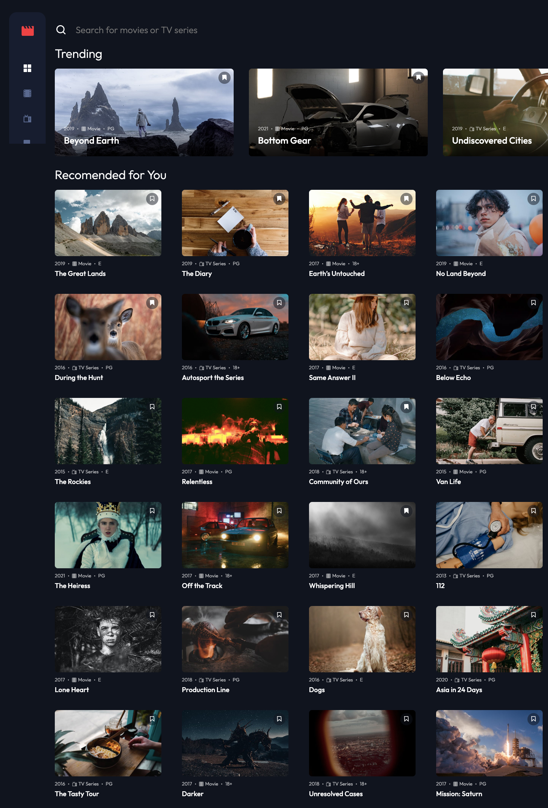

# Frontend Mentor - Entertainment web app solution

This is a solution to the [Entertainment web app challenge on Frontend Mentor](https://www.frontendmentor.io/challenges/entertainment-web-app-J-UhgAW1X). Frontend Mentor challenges help you improve your coding skills by building realistic project.

## Table of contents

- [Overview](#overview)
  - [The challenge](#the-challenge)
  - [Screenshot](#screenshot)
  - [Links](#links)
- [My process](#my-process)
  - [Built with](#built-with)
  - [What I learned](#what-i-learned)
  - [Continued development](#continued-development)
  - [Useful resources](#useful-resources)
- [Author](#author)
- [Acknowledgments](#acknowledgments)

## Overview

### The challenge

Users should be able to:

- View the optimal layout for the app depending on their device's screen size
- See hover states for all interactive elements on the page
- Navigate between Home, Movies, TV Series, and Bookmarked Shows pages
- Add/Remove bookmarks from all movies and TV series
- Search for relevant shows on all pages
- **Bonus**: Build this project as a full-stack application
- **Bonus**: If you're building a full-stack app, we provide authentication screen (sign-up/login) designs if you'd like to create an auth flow

### Screenshot




### Links

- Solution URL: [Add solution URL here](https://www.frontendmentor.io/solutions/full-mern-stack-app-with-redux-toolkit-SJDUtz779)
- Live Site URL: [Add live site URL here](https://mbentertainmentapp.herokuapp.com/)

## My process

### Built with

- Semantic HTML5 markup
- SASS/SCSS
- BEM naming convention, wherever possible
- Flexbox/Grid
- Mobile-first and accessible workflow
- [React](https://reactjs.org/) - Frontend library
- [Redux Toolkit](https://redux-toolkit.js.org/) - Redux Toolkit for global state management
- [React Router](https://v5.reactrouter.com/) - React Router for navigation
- [React Hook Form](https://react-hook-form.com/) - React Hook Form for handling sign-up/login forms 
- [Express.js](https://expressjs.com/) - Server side framework
- [Node.js](https://nodejs.org/en/) - Node JS
- [Mongoose JS](https://mongoosejs.com/) - For database management
- [JWT](https://jwt.io/) - JSON Web Tokens for authenticating users


### What I learned

This was my first ever full stack application, and my first time working with Express and MongoDB. Full credit must go to Brad Traversy and his [excellent tutorial series](https://www.youtube.com/c/TraversyMedia/playlists) on learning the MERN stack.

Though I was slightly overwhelmed with a lot of the initial set-up to get the Express server running, connected to MongoDB Atlas and linking everything up with JSON Web Tokens, learning the foundational code structure of each framework soon become second nature.

Having worked with PHP in the past, I was amazed at how simple Mongoose made querying the database.

Eg:

```js
const loginUser = asyncHandler(async (req, res) => {
    const {email, password} = req.body
    const user = await User.findOne({email})

    if(user && (await bcrypt.compare(password, user.password))) {
        res.json({
            _id: user.id,
            email: user.email,
            token: generateToken(user._id),
            bookmarks: user.bookmarks
        })
    } else {
        res.status(400)
        throw new Error('Invalid credentials')
    }
})
```

This project also saw me FINALLY taking the plunge and using Redux for my global state management. Like many others, I have always been put off by it's complexity and the tons of extra code that is needed to implement a tiny bit of state. With Redux Toolkit, a lot of the extra code is stripped away although I found it vital to get a solid understanding of how Redux actually works in order to understand what Redux Toolkit was doing under the hood. I've linked to some good resources below. With the online tutorial only taking me so far, I threw of the shackles and did a pretty good job (I hope!) of implementing some working global state on my own!

React Hook Form has become a mainstay of my applications, and I have to say it makes handling forms in React so much easier -- there's no need for local state to populate input values, and no onChange functions to handle user input, and the majority of the error handling is done for you.

In terms of CSS, this project may well have been the point at which I fully converted from a 'Flexbox Guy' to a 'Grid Guy'. Flexbox has always been my 'go-to' layout due to its ease of implementation and less code, but I find it does some really weird stuff and I end up having to reverse engineer a lot of things.

For example, in this project I tried to implement the grid layout of the video tiles using Flexbox, which worked OK, but I stumbled upon an error when items autowrap. If you have an odd number of items of the final row once you've set -- 
```css 
.item {
  justify-content: space-between;
}
```
-- then the final two items will spread apart to each end of the grid and not flow one after the other, which looks horrible. A simple implementation of grid solves this problem very easily.

This [article](https://travishorn.com/some-ways-to-align-the-last-row-in-a-flexbox-grid-720f365dcb16) did a really good job of explaining the problem and giving a solution.


### Continued development

With so many new frameworks crammed into a single project, I have so much to build on. Redux Toolkit will no doubt become a mainstay in my React applications from now on, so I'd like to delve a little bit deeper into it.

Similarly, I feel I've only just scratched the surface with Express and MongoDB and so I'll try and take some more in-depth tutorials on both of them separately.

### Useful resources

- [Brad Traversy's 'Learn the MERN stack' tutorial](https://www.youtube.com/c/TraversyMedia/playlists) - A fantastic resource for learning and implementing the MERN stack by building a real project.
- [Valentino Gagliardi blog on Redux for Dummies](https://www.valentinog.com/blog/redux/) - A really good resource for getting your head around Redux before moving on to Redux Toolkit.


## Author

- Personal Website - [MWB Design](https://www.mwbdesign.co.uk)
- Frontend Mentor - [@MikeBish13](https://www.frontendmentor.io/profile/mikebish13)
- Twitter - [@MikeBish13](https://www.twitter.com/mikebish13)


## Acknowledgments

For the final time, big shout out and thanks to Brad Traversy and his MERN stack course.
